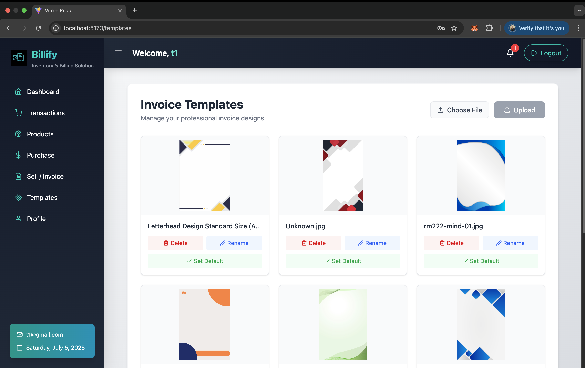

Bilify - Inventory & Billing Solution for Retailers

Bilify is a comprehensive inventory and billing system designed specifically for offline retailers. Manage your stock, analyze sales trends, process transactions, and generate professional invoices - all in one powerful platform with real-time synchronization across all billing counters.

Key Features

**Real-time Inventory Management:**
 Track stock levels with instant updates
**Advanced Analytics:**
Visualize sales data with interactive charts
**Custom Invoice Templates:** 
Create branded invoices with your shop's identity
**Instant Notifications:**
 Get alerts for transactions across all counters
**Multi-counter Sync:**
 Seamless coordination between multiple billing stations
Technology Stack

Frontend: React, Tailwind CSS, Framer Motion, STOMP Sock
Backend: Spring Boot, Java, Lombok, WebSocket
Database: PostgreSQL
Visualization: Recharts
Notifications: React Toastify

📸 Visual Walkthrough

Core Functionality

 <h3>Inventory Management</h3>  <h3>Sales Analytics</h3>  

Transaction Processing

 <h3>Transaction Processing</h3>   

Invoice & Customization

 <h3>Invoice Customization</h3>   

Real-time Features

 <h3>Instant Notifications</h3>  

Key Features in Detail

📦 Inventory Management

Real-time stock tracking across all counters
Low-stock alerts and automatic reordering suggestions
Batch and expiry date tracking
Supplier management

📊 Sales Analytics

Interactive dashboards with Recharts
Daily, weekly, monthly sales reports
Product performance insights
Customer purchase patterns

🧾 Custom Invoicing

Create and save custom invoice templates
Add shop logo and branding elements
Predefined templates for quick setup
Print  invoices directly

🔔 Real-time Notifications

Instant alerts for transactions at all counters
Stock updates visible across all devices
Promotional notifications for staff
Printer status updates

🚀 Getting Started

Prerequisites

Java JDK 17+
Node.js (v16+)
PostgreSQL (v14+)
Installation

bash
# Clone repository
git clone https://github.com/atul074/Billify
cd bilify

# Install frontend dependencies
cd frontend
npm install

# Build frontend
npm run build

# Run backend (from project root)
cd ../backend
./mvnw spring-boot:run
Configuration

Create application.properties in backend/src/main/resources:

properties
spring.datasource.url=jdbc:postgresql://localhost:5432/bilify
spring.datasource.username=postgres
spring.datasource.password=yourpassword
spring.jpa.hibernate.ddl-auto=update

bilify.invoice.template-path=/path/to/templates
🤝 Contributing

Contributions are welcome! Please read our contribution guidelines before submitting pull requests.

✉️ Contact

Project Lead: ATUL TANDAN - atultandan074@gmail.com
Project Link: https://github.com/atul074/Billify

Transform Your Retail Business with Bilify 🛒💻

     
